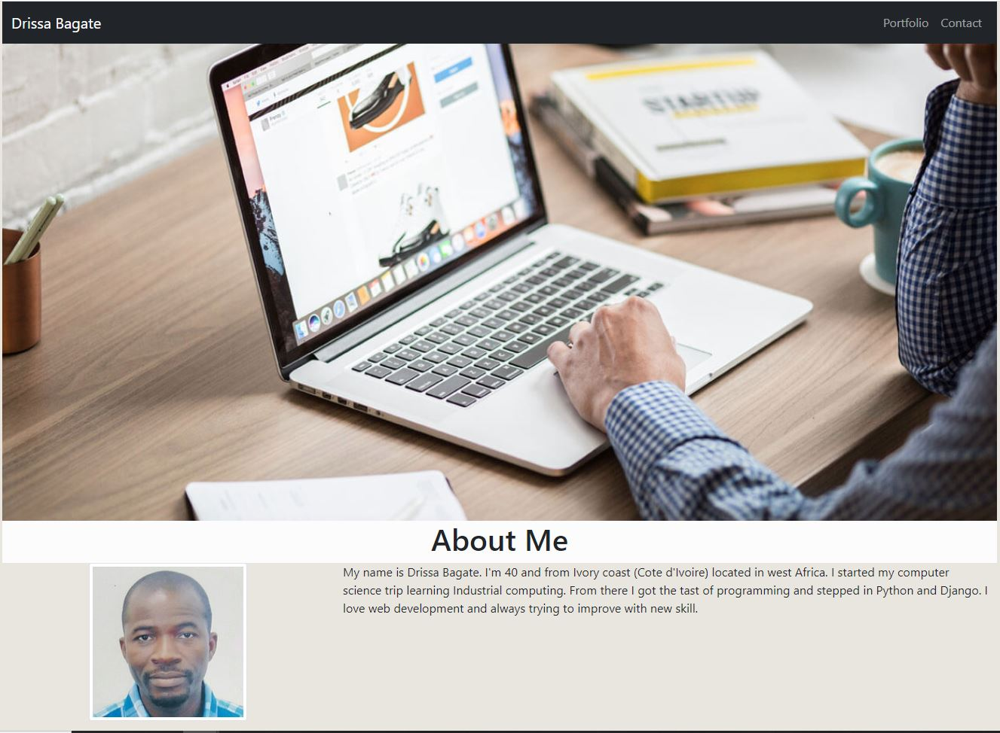
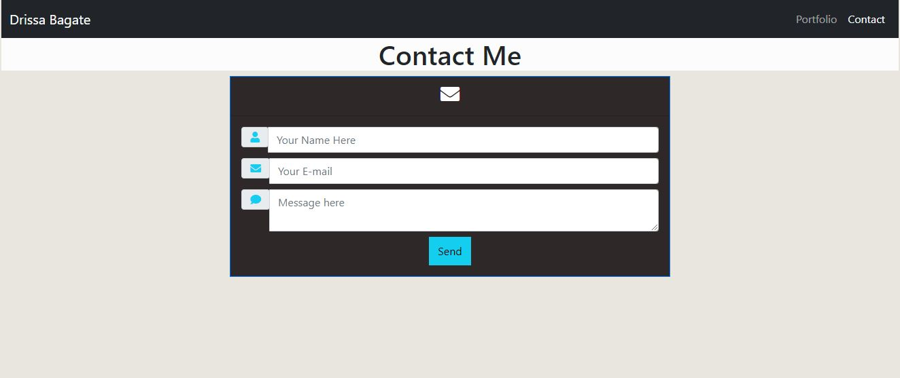

# Portfolio using Bootstrap 

## Subject: Responsive Portfolio

## Description:
This project is to make a responsive portfolio website using bootstrap avoiding the use of media query.

### See Website
[Click Here](https://lemanou7.github.io/portfolio_work/) to see the application.


### Installation


<!-- GETTING STARTED -->

This is some useful steps, you must meet to run this html and css code correctly 

### Prerequisites
You can use any code editor of user choise, i use Vs Code because it is open source and it understand git and do syntax highlighting very nicely.

* Go to
  [Click Here](https://code.visualstudio.com/download) to download Vs Code to your computer.
  

1. Clone the repo
   ```sh
   git clone https://github.com/lemanou7/portfolio_work.git
   ```
2. Get a linux shell emulator like Git bash or Powershell then:
    ```sh
    cd to where your repository folder is located in your computer
    ```
3. Run the html file by entering this command if using Vs Code

   ```sh
      code index.html
   ```

4. Run the html file by entering this command if using Vs Code
   ```sh
   code index.html
   ```
   Right Click and Click on the option: "Open in Defauld Browser" or Alt B


### See Website Screenshots

5. Full Webpage 



5. Portfolio page


5. Contact page 




<!-- CONTACT -->
## Contact

Drissa Bagate (<span style="color:#5ddcf0">**Django, Javascript Full Stack Developer**</span>) [GitHub](https://github.com/lemanou7) - lemanou7@yahoo.fr

Other Project link: [My Blog Post Python-Django Implemation](http://grandbuzz.herokuapp.com/)


